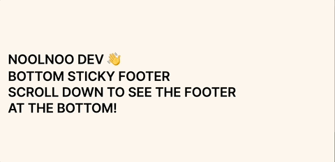
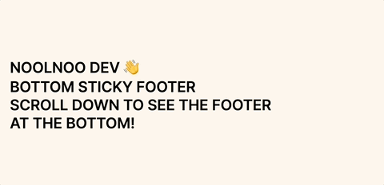

# bottom-sticky-footer



Javascript 없이 CSS만으로 바닥에 붙어 있는 Footer 애니메이션입니다.

📌 DEMO
https://eveneul.github.io/bottom-sticky-footer/

💻 기술 스택: HTML, CSS

📄 폴더 구조

```
└── bottom-sticky-footer/
    ├── index.html
    └── style.css
```

## 마크업 구성

```html
<body>
	<main class="container">...</main>
	<footer>...</footer>
</body>
```

## CSS Style

우선 `footer`의 `height`를 명시적으로 주어야 합니다. 예시에서는 `400px`로 작업했습니다.
또, `footer`에 `position: fixed`와 `z-index: 1`를 주어야 합니다.

```css
footer {
	position: fixed;
	bottom: 0;
	left: 0;
	z-index: 1;
	height: 400px;
	// 이하 생략
}
```

그리고 `main` 태그의 `margin-bottom`을 `footer`의 `height`와 같은 값으로 주어야 합니다.

```css
main {
	position: relative;
	z-index: 2;
	margin-bottom: 400px;
}
```

## IOS에서의 스크롤 바운싱 문제



IOS 환경에서 트랙패드나 매직마우스로 스크롤할 때 발생하는 바운싱을 억지로 막기보다는, `body` 배경색을 마지막 `section`의 `background-color`와 맞춰서 설정했습니다. 이렇게 하면 바운싱 자체는 그대로 두면서도, 이로 인한 화면 이질감을 최소화해 보다 자연스러운 느낌을 주도록 했습니다.
